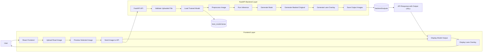
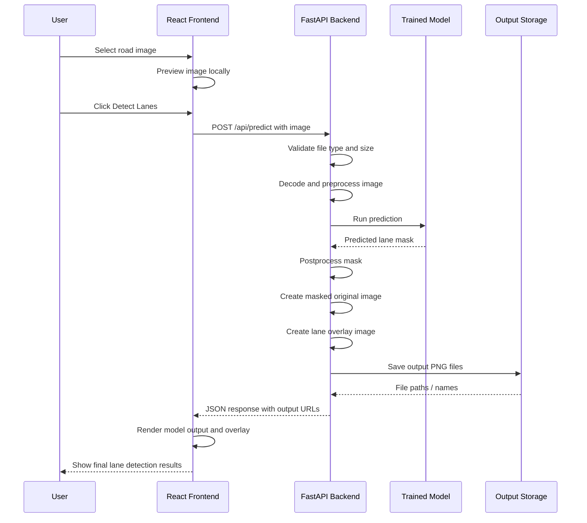

# System Diagram

## High-Level System Architecture

---

## Detailed Data Flow

---

## Component Explanation

### 1. User

The user interacts with the system through the browser by:

- uploading a road image
- previewing the selected image
- requesting lane detection
- viewing the final results

### 2. React Frontend

The frontend is responsible for:

- file selection and upload
- image preview before inference
- showing loading and error states
- displaying final result images returned by the backend

Visible frontend outputs:

- model output
- lane overlay

### 3. FastAPI Backend

The backend is responsible for:

- receiving the uploaded image
- validating file type and size
- loading the trained segmentation model
- preprocessing the image to the model input size
- running inference
- converting the raw model prediction into visual outputs

### 4. Trained Model

The trained model file:

- `best_model.keras`

This model performs lane-region segmentation on the uploaded road image.

### 5. Output Storage

Generated result images are written to:

- `backend/outputs/`

These files are then served back to the frontend as static URLs.

---

## Functional Summary

The system works in the following order:

1. The user uploads a road image in the React frontend.
2. The frontend sends the image to the FastAPI backend.
3. The backend preprocesses the image and runs inference using `best_model.keras`.
4. The backend generates:
   - lane mask
   - masked original image
   - lane overlay
5. The backend stores the generated outputs and returns their URLs.
6. The frontend shows the processed outputs to the user.

---

## Short Description for Report Use

This project follows a client-server architecture. The React frontend handles user interaction, image upload, and result presentation. The FastAPI backend handles model loading, preprocessing, inference, postprocessing, and output generation. The trained lane-segmentation model predicts lane regions from uploaded road images, and the backend converts the prediction into visually interpretable outputs such as masked lane-region images and lane overlays. These outputs are returned to the frontend and presented to the user through a browser interface.
